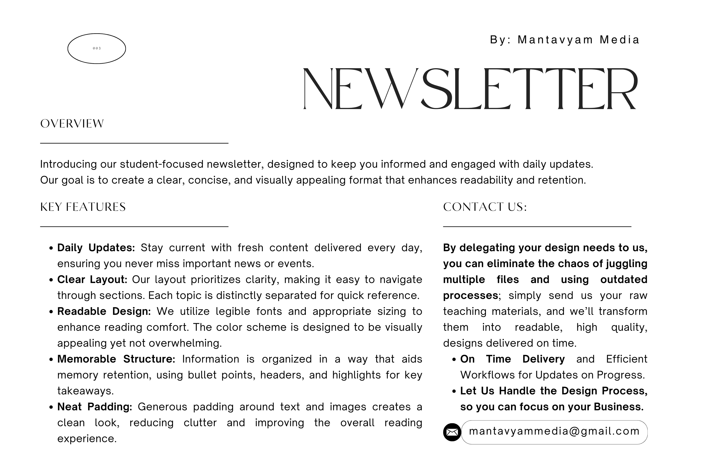

# Welcome to NoteGliders

## Project info

**About**
A SaaS web application that automates the creation of dynamically designed PDF newsletters by processing a Markdown document and associated image assets.




## How can I edit this code?

If you want to work locally using your own IDE, you can clone this repo and push changes. 

The only requirement is having Node.js & npm installed - [install with nvm](https://github.com/nvm-sh/nvm#installing-and-updating)

Follow these steps:

```sh
# Step 1: Clone the repository using the project's Git URL.
git clone <YOUR_GIT_URL>

# Step 2: Navigate to the project directory.
cd <YOUR_PROJECT_NAME>

# Step 3: Install the necessary dependencies.
npm i

# Step 4: Start the development server with auto-reloading and an instant preview.
npm run dev

# Step 5: Start the Backend Service in separate terminal.
cd backend
python3 -m venv venv
source venv/bin/activate
pip install -r requirements.txt
```

## What technologies are used for this project?

This project is built with .

**Frontend**
- Vite: For fast development and optimized builds
- React: Core UI library
- TypeScript: For type safety
- React Router: For client-side routing
- TanStack Query: For server state management and data fetching
- Axios: For API requests to the backend
- shadcn-ui: Component library built on Radix UI
- Tailwind CSS: For utility-first styling
- Framer Motion: For animations
- JSZip: For handling ZIP files

**Backend**
- Python: Main backend language
- FastAPI: Web framework for building APIs
- Uvicorn: ASGI server to run FastAPI
- WeasyPrint: For generating PDFs from HTML/CSS
- python-multipart: For handling file uploads
- Markdown: For converting Markdown to HTML
- python-dotenv: For environment variable management
- Pydantic: For data validation

**Communication**
- REST API: For communication between frontend and backend
- FormData: For sending files from frontend to backend

## Project Tree
```
tree -I 'venv|static|output|temp|node_modules|__pycache__|components'
```

```
├── README.md
├── backend
│   ├── README.md
│   ├── main.py
│   ├── requirements.txt
│   └── templates
│       ├── brandings
│       │   ├── Footer.html
│       │   ├── Header-Constant.html
│       │   └── Header-Main.html
│       ├── compilationLayout.html
│       ├── magazineLayouts
│       │   ├── appointLayout.html
│       │   ├── awardLayout.html
│       │   ├── bankingLayout.html
│       │   ├── booksLayout.html
│       │   ├── brandLayout.html
│       │   ├── defenceExerciseLayout.html
│       │   ├── defenceNewsLayout.html
│       │   ├── festivalsLayout.html
│       │   ├── gdpLayout.html
│       │   ├── impDaysLayout.html
│       │   ├── internationalLayout.html
│       │   ├── mouLayout.html
│       │   ├── nationalLayout.html
│       │   ├── obituaryLayout.html
│       │   ├── rbiCornerLayout.html
│       │   ├── reportsLayout.html
│       │   ├── scienceLayout.html
│       │   ├── sportsLayout.html
│       │   ├── stateLayout.html
│       │   └── visitsLayout.html
│       │   ├── Xtras
│       │   │   ├── 100McqLayout.html
│       │   │   ├── crackerTabular.html
│       │   │   └── staticAwareness.html
│       └── newsletterLayout.html
├── bun.lockb
├── components.json
├── eslint.config.js
├── index.html
├── package-lock.json
├── package.json
├── postcss.config.js
├── public
├── src
│   ├── App.css
│   ├── App.tsx
│   ├── hooks
│   ├── index.css
│   ├── lib
│   ├── main.tsx
│   ├── pages
│   │   ├── BuildPage.tsx
│   │   ├── CompilationPage.tsx
│   │   ├── DashboardPage.tsx
│   │   ├── DownloadPage.tsx
│   │   ├── Index.tsx
│   │   ├── MagazinePage.tsx
│   │   ├── NotFound.tsx
│   │   └── Newsletter.tsx
│   ├── services
│   └── vite-env.d.ts
├── tailwind.config.ts
├── tsconfig.app.json
├── tsconfig.json
├── tsconfig.node.json
└── vite.config.ts
```
